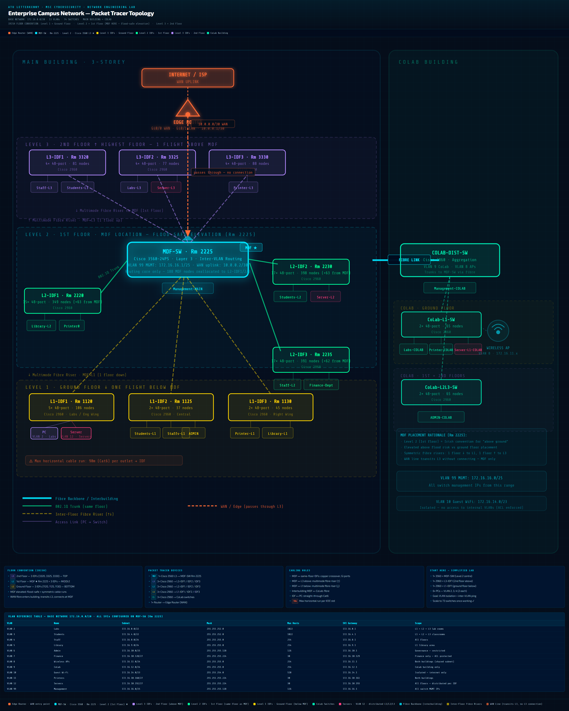

# Enterprise Campus Network Design — ATU Letterkenny

**Network Infrastructure Project | MSc Cybersecurity Portfolio**
*Atlantic Technological University, Letterkenny | March 2026*

> **Educational Context:** This project simulates the full enterprise network infrastructure for ATU Letterkenny's two-building campus using Cisco Packet Tracer. All design decisions, IP addressing, security configurations, and architectural choices reflect production-grade enterprise standards.

---

## Project Overview

This project designs and implements a fully segmented, routed, and hardened enterprise campus network spanning two buildings, 13 VLANs, 3,324 addressable ports, and 74 switches. The network provides complete Layer 2 isolation between departments, centralised Layer 3 inter-VLAN routing, a dedicated management plane, wireless infrastructure for staff and guests, and a structured security hardening baseline across every access port.

**Scale:**

| Building | Floors | Switches | Total Ports |
|---|---|---|---|
| Main Building | 3 (Ground, 1st, 2nd) | 10 (MDF + 9 IDFs) | 3,234 |
| CoLab Building | 2 levels | 3 | 90 |
| **Total** | | **74** | **3,324** |

---

## Network Architecture

### Physical Topology



> **Figure 1:** Enterprise campus network topology showing MDF core switch, 9 IDF access switches across 3 floors (Main Building), CoLab building integration, and EDGE-RTR WAN uplink. Simulated in Cisco Packet Tracer 8.x.

```
WAN / Internet
      |
   EDGE-RTR (Router-PT)
      | Fa0/0 — 10.0.0.1/30
      |
   MAIN-MDF-Switch (Rm 2225) — Level 2 / 1st Floor
      | 10.0.0.2/30
      |
      |— Fa0/1  → L1-IDF1 (Rm 1120)   Level 1 / Ground Floor
      |— Fa0/2  → L1-IDF2 (Rm 1125)   Level 1 / Ground Floor
      |— Fa0/3  → L1-IDF3 (Rm 1130)   Level 1 / Ground Floor
      |
      |— Fa0/4  → L2-IDF1 (Rm 2220)   Level 2 / 1st Floor
      |— Fa0/5  → L2-IDF2 (Rm 2230)   Level 2 / 1st Floor
      |— Fa0/6  → L2-IDF3 (Rm 2235)   Level 2 / 1st Floor
      |
      |— Fa0/7  → L3-IDF1 (Rm 3320)   Level 3 / 2nd Floor
      |— Fa0/8  → L3-IDF2 (Rm 3325)   Level 3 / 2nd Floor
      |— Fa0/9  → L3-IDF3 (Rm 3330)   Level 3 / 2nd Floor
      |
      |— Fa0/10 → COLAB-CORE-SW        CoLab Building
```

### VLAN Architecture

| VLAN | Name | Subnet | Mask | Gateway | Hosts |
|---|---|---|---|---|---|
| 2 | Labs | 172.16.0.0 | /22 | 172.16.0.1 | 1,022 |
| 3 | Students | 172.16.4.0 | /22 | 172.16.4.1 | 1,022 |
| 4 | Staff | 172.16.8.0 | /24 | 172.16.8.1 | 254 |
| 5 | Library | 172.16.9.0 | /24 | 172.16.9.1 | 254 |
| 6 | Admin | 172.16.10.0 | /25 | 172.16.10.1 | 126 |
| 7 | Finance | 172.16.10.128 | /27 | 172.16.10.129 | 30 |
| 8 | Wireless-APs | 172.16.11.0 | /24 | 172.16.11.1 | 254 |
| 9 | CoLab | 172.16.12.0 | /24 | 172.16.12.1 | 254 |
| 10 | Guest-WiFi | 172.16.14.0 | /23 | 172.16.14.1 | 510 |
| 11 | Printers | 172.16.10.160 | /27 | 172.16.10.161 | 30 |
| 12 | Servers | 172.16.10.192 | /27 | 172.16.10.193 | 30 |
| 99 | Management | 172.16.16.0 | /25 | 172.16.16.1 | 126 |

Base address space: **172.16.0.0/20** — fully subnetted using VLSM.
WAN point-to-point link: **10.0.0.0/30** (MDF-SW: 10.0.0.2, EDGE-RTR: 10.0.0.1).

---

### VTP Architecture

| Switch | VTP Mode | Reason |
|---|---|---|
| MAIN-MDF-Switch | Server | Single authoritative VLAN source |
| All Main Building IDFs (×9) | Transparent | Local VLAN control; immune to revision number attack |
| COLAB-CORE-SW | Off | Full administrative isolation |
| COLAB-L1, COLAB-L2 | Off | Full administrative isolation |

**Domain:** ATU-CAMPUS | **Password:** MD5 hashed (hidden)

Transparent mode on all IDFs was a deliberate security decision. It prevents rogue switches from overwriting the VLAN database by forwarding VTP advertisements without processing them.

---

### Switch Management IPs (VLAN 99 — 172.16.16.0/25)

| Switch | Management IP |
|---|---|
| MAIN-MDF-Switch | 172.16.16.1 |
| L1-IDF1 | 172.16.16.2 |
| L1-IDF2 | 172.16.16.3 |
| L1-IDF3 | 172.16.16.4 |
| L2-IDF1 | 172.16.16.5 |
| L2-IDF2 | 172.16.16.6 |
| L2-IDF3 | 172.16.16.7 |
| L3-IDF1 | 172.16.16.8 |
| L3-IDF2 | 172.16.16.9 |
| L3-IDF3 | 172.16.16.10 |
| COLAB-CORE-SW | 172.16.16.12 |
| COLAB-L1 | 172.16.16.13 |
| COLAB-L2 | 172.16.16.14 |

All switches accessible via SSH v2 from Management-MAIN PC (VLAN 6) through inter-VLAN routing at MDF-SW.

---

## Security Design Decisions

### Trunk Port Security
- All trunk ports use `switchport nonegotiate` — DTP completely disabled network-wide
- Per-port allowed VLAN lists applied (least privilege) — each trunk carries only VLANs required by connected switch
- Native VLAN set to 99 on all trunks — VLAN 1 carries zero production traffic
- IEEE 802.1Q encapsulation explicitly configured on 3560 (dot1q only; ISL disabled)

### Access Port Security
- `spanning-tree portfast` enabled on all end device ports — fast convergence without bridging risk
- `spanning-tree bpduguard enable` on all access ports — automatic err-disable on rogue switch connection
- All unused ports administratively shutdown and assigned to VLAN 99
- `switchport nonegotiate` applied to access ports — prevents mode negotiation attacks

### Management Plane Separation
- VLAN 99 reserved exclusively for switch management SVIs — no end user devices
- Administrative workstations placed in VLAN 6 (Admin) — routing boundary between user and management plane
- SSH v2 with RSA 2048-bit keys on all switches — no Telnet permitted
- `transport input ssh` on all VTY lines — encrypted management sessions only
- `exec-timeout 5 0` — automatic session termination after 5 minutes idle

### Planned — Phase 5
- Extended ACLs on MDF-SW SVIs: block Guest-WiFi (VLAN 10) routing to Finance (VLAN 7) and Admin (VLAN 6)
- Standard ACLs: restrict management plane access to authorised admin subnets only
- Port security: sticky MAC address learning with violation shutdown on critical access ports

---

## Implementation Status

| Phase | Description | Status |
|---|---|---|
| 1 | VLSM design, VLAN architecture, IP addressing table | Complete |
| 2 | VTP configuration, VLAN creation, trunk ports on MDF-SW | Complete |
| 3 | SVIs on MDF-SW, ip routing, inter-VLAN routing verified | Complete |
| 4 | Access ports on all 9 main building IDFs, end device IPs | Complete |
| 4a | Management IPs, SSH hardening on all main building switches | Complete |
| 4b | Connectivity verification — all VLAN pairs tested and confirmed | Complete |
| 5 | CoLab building integration | In Progress |
| 6 | EDGE-RTR configuration, default routing | Pending |
| 7 | RIP v2 routing protocol | Pending |
| 8 | OSPF migration and tuning, passive interfaces | Pending |
| 9 | ACLs — standard and extended | Pending |
| 10 | Firewall configuration | Pending |
| 11 | Final documentation, mental drill review document | Pending |

---

## Key Engineering Decisions

**Why VLSM instead of uniform subnet sizes?**
Using /27 for Finance (30 hosts) and /22 for Students (988 hosts) ensures address space is allocated based on actual needs, avoiding wastage of over 3,000 addresses.

**Why VTP Transparent on IDFs rather than Client?**
A VTP Client switch unconditionally accepts VLAN database updates from any switch with a higher revision number on the same domain. Using VTP Transparent on Intermediate Distribution Frames (IDFs) prevents rogue switches from affecting VLAN configurations, enhancing security. All 9 main building IDFs run Transparent.

**Why separate Admin users (VLAN 6) from Management plane (VLAN 99)?**
Keeping admin users in VLAN 6 and management interfaces in VLAN 99 restricts direct access to critical infrastructure. A compromised workstation would have direct Layer 2 access to all switch management IPs with no routing boundary. Keeping admin users in VLAN 6 forces all management traffic through MDF-SW inter-VLAN routing, where ACLs can be applied to restrict access further.

**Why /30 for the WAN link?**
A point-to-point router link needs exactly two usable addresses — one per end. A /30 provides exactly that avoiding waste compared to larger subnets.

**Why nonegotiate on every port including access ports?**
DTP (Dynamic Trunking Protocol) on access ports allows an attacker to negotiate a trunk link from an end device, gaining access to all VLANs on the switch. Disabling DTP with `nonegotiate` on every port, both trunk and access which eliminates this VLAN hopping attack vector entirely.

---

## Lessons Learned

**Verify immediately after every configuration step.** A single digit typo in an SVI IP address (72.16.4.1 instead of 172.16.4.1) silently broke routing for an entire VLAN. Running `show ip interface brief` immediately after each SVI configuration catches this quickly.

**One VLAN equals one subnet equals one gateway.** Assigning different gateway IPs to devices in the same VLAN on different floors breaks routing for those devices. The MDF-SW SVI is the single gateway for each VLAN regardless of which floor the device is on. This is a fundamental principle of inter-VLAN routing architecture.

**MAC address table analysis is the most direct connectivity diagnostic.** If a ping fails, checking the destination MAC on the switch reveals if there’s a physical problem, VLAN error, or routing issue.

**Duplicate IPs are immediately catastrophic.** Two switches assigned the same management IP create an ARP conflict that makes management access completely unpredictable. IP address management discipline — tracking every assignment before configuring — prevents this entirely.

---

## Tools and Technologies

- **Cisco Packet Tracer 8.x** — network simulation
- **Cisco Catalyst 3560-24PS** — Layer 3 core switch (MDF)
- **Cisco Catalyst 2960** — Layer 2 access switches (IDFs)
- **Cisco IOS CLI** — all configuration via command line
- **IEEE 802.1Q** — VLAN trunking standard
- **VTP v2** — VLAN Trunking Protocol
- **Spanning Tree Protocol (STP)** — loop prevention
- **SSH v2 / RSA 2048** — encrypted management access

---

[← Back to Portfolio](../../README.md) | [View Project Summary](./PROJECT_SUMMARY_CampusNetwork.md)
