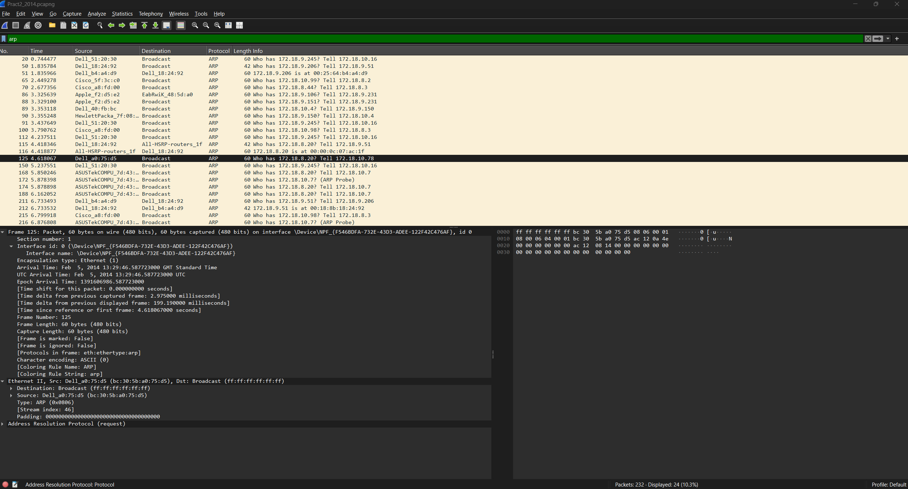
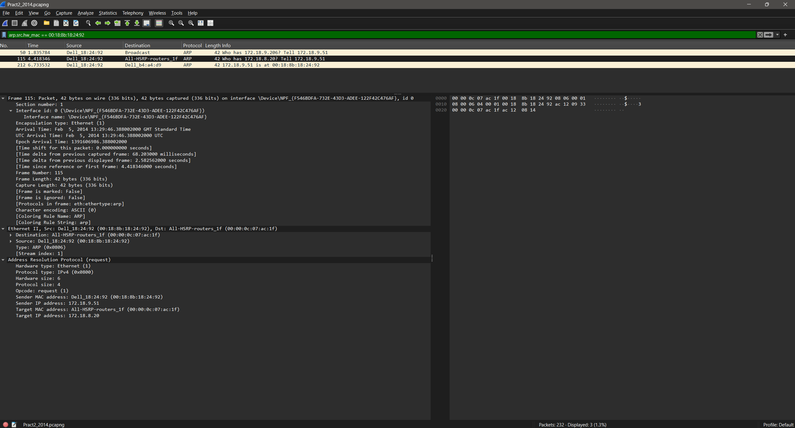
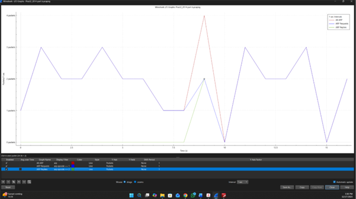

# ARP Protocol Analysis — Address Resolution Protocol Traffic Study

## Overview

This repository documents a packet-level analysis of ARP (Address Resolution Protocol) traffic captured using Wireshark, covering request/reply pattern identification, the relationship between ARP and DNS across capture sessions, traffic isolation techniques, source filtering, volume analysis, and I/O graph visualisation.

The analysis covers:

- ARP request and reply pattern identification
- Why ARP was used instead of DNS
- Cross-protocol noise filtering to isolate target traffic
- ARP traffic volume and opcode filtering
- Source MAC-based ARP filtering
- I/O graph visualisation of ARP traffic patterns

---

## Logical Flow

```
ARP Pattern Identification → Why ARP Was Used Instead of DNS → Traffic Isolation
→ Source Filtering → Volume Analysis → I/O Visualisation → Cross-Protocol Noise Filtering
```

Each stage builds on the previous: first confirming what the ARP packets are and the role each device played, then establishing why ARP appeared in place of DNS in this capture, isolating ARP from surrounding protocol noise, narrowing focus to a specific source machine, and finally visualising the full ARP traffic pattern over time using an I/O graph to identify resolution success and failure patterns.

---

## 1. Identifying ARP Request and Reply Patterns (Capture B - Packets 212 & 213)

Packets 212 and 213 were identified as an ARP Request/Reply exchange. They can be isolated using either the display filter `arp` or the exact packet filter:

```
frame.number == 212 || frame.number == 213
```

**ARP exchange summary:**

| Packet | Type | From MAC | From IP | Query |
|---|---|---|---|---|
| 212 | Broadcast ARP Request | 00:18:8b:18:24:92 (Dell) | 172.18.9.51 | "Who has 172.18.9.206? Tell 172.18.9.51" |
| 213 | Unicast ARP Reply | 00:25:64:b4:a4:d9 | 172.18.9.206 | "172.18.9.206 is at MAC 00:25:64:b4:a4:d9" |

ARP operates at **Layer 2**, mapping IP addresses to MAC addresses to enable local Ethernet frame delivery.

**Packet 212 — Broadcast Request:** The Dell device (00:18:8b:18:24:92) at 172.18.9.51 broadcasts to `ff:ff:ff:ff:ff:ff` — the Layer 2 all-hosts broadcast address — asking which device holds IP 172.18.9.206. Since this is a Layer 2 operation, ARP is used rather than ICMP.

**Packet 213 — Unicast Reply:** The device at 172.18.9.206 (MAC 00:25:64:b4:a4:d9), recognising its own IP in the request, replies directly to the requester's MAC address via unicast. The responding device then stores the requester's MAC in its ARP cache to avoid repeated broadcast requests for the same address.

---

📷 **Image 1 — ARP Request and Reply Packets 212 and 213**


---

## 2. Why ARP Was Used Instead of DNS

ARP did not replace DNS — both protocols serve complementary functions at different network layers. Their roles in the full resolution sequence are distinct:

| Protocol | Resolves | Layer |
|---|---|---|
| DNS | Hostname → IP Address | Layer 3 (Application/Network) |
| ARP | IP Address → MAC Address | Layer 2 (Data Link) |

In sequence, DNS occurs first to obtain the IP address, followed by ARP to obtain the MAC address required for Layer 2 frame delivery. However, in Capture B, DNS traffic was absent because the hostname-to-IP mapping had already been resolved in Capture A (packet 49) and remained cached within its TTL window of 3,600 seconds. The OS retrieved the IP address from local cache, eliminating the need for a new DNS query.

Since both hosts resided on the same local subnet, ARP was sufficient for MAC address resolution without involving any gateway. For inter-network communication, ARP would only resolve the MAC of the next-hop gateway, with each subsequent router performing its own ARP lookup for the following hop. This hop-by-hop MAC resolution combined with end-to-end IP routing enables internet-scale communication while preventing the broadcast floods that would occur if ARP were to operate globally.

---

## 3. Removing ARP from Multi-Protocol Captures (Cross-Protocol Noise Filtering)

To reduce protocol noise and isolate specific traffic types from a busy mixed-protocol capture, the following compound exclusion filter was applied:

```
!udp && !arp && !tcp && !icmpv6 && !stp && !pim && !ospf
```

**Filter effect:**

| Excluded | Protocols Removed |
|---|---|
| `!udp` | UDP traffic — also suppresses DNS (port 53) and DHCP (ports 67–68) |
| `!arp` | All ARP broadcasts and replies |
| `!tcp` | TCP traffic — also suppresses HTTP (port 80) |
| `!icmpv6` | IPv6 control messages |
| `!stp` | Spanning Tree Protocol |
| `!pim` | Protocol Independent Multicast |
| `!ospf` | Open Shortest Path First routing traffic |

**Remaining visible protocols:** ICMP and IGMPv2.

**IGMPv2 (Internet Group Management Protocol v2)** was revealed by this filter — a Network Layer protocol used by hosts and routers to manage IPv4 multicast group memberships. It allows hosts to join or leave multicast groups and helps routers determine which hosts want to receive multicast traffic.

> **IGMP vs ICMP distinction:** IGMP messages are exchanged between hosts and multicast routers to indicate interest in receiving multicast traffic. ICMP messages are generated by hosts, routers, or the network stack to report network conditions such as unreachable destinations or TTL expiry. They are separate protocols with separate functions.

This compound exclusion technique is standard practice during protocol-specific forensic analysis to reduce visual clutter and focus on the target protocol.

---

📷 **Image 3 — Compound Exclusion Filter Applied**


---

## 4. Filtering ARP Traffic and Volume Analysis

The Wireshark filter `arp` isolates all ARP packets by their EtherType value (**0x0806**) — the IEEE-designated identifier for the ARP protocol. Applying this filter returned **35 packets**.

**Opcode-based filtering for granular analysis:**

| Opcode | Meaning | Wireshark Filter |
|---|---|---|
| 1 | ARP Request ("Who has...?") | `arp.opcode == 1` |
| 2 | ARP Reply ("...is at...") | `arp.opcode == 2` |

Using opcodes rather than just `arp` allows analysts to separate query and response patterns, and to detect **unsolicited ARP replies** — a key indicator of ARP spoofing attacks, where a malicious device sends unrequested replies to poison ARP caches.

**Observed devices in the capture:** Dell, Cisco, Apple, and Compal devices were identified as sources, with the majority of packets being broadcast requests of **60 bytes**. Two exceptions — packets 212 and 224 — were unicast reply packets of **45 bytes**, reflecting the smaller frame size of a directed reply vs a full broadcast.

---

📷 **Image 4 - ARP Filter Applied, 35 Packets Returned**



---

## 5. Filtering ARP Packets by Source MAC Address

To isolate ARP traffic originating specifically from the source client machine (IP: 172.18.9.51, MAC: 00:18:8b:18:24:92), the following filter was applied:

```
arp.src.hw_mac == 00:18:8b:18:24:92
```

This returned **2 packets:**

| Packet | Type | Description |
|---|---|---|
| 212 | ARP Request (Broadcast) | Querying the MAC address of 172.18.9.206 |
| 224 | ARP Reply (Unicast) | Responding to a separate ARP query directed at the client |

This filter matches the **Sender Hardware Address** field in the ARP packet — capturing both ARP requests sent by the source machine and any ARP replies it sends in response to queries from other devices.

An equivalent alternative filter targeting the Ethernet frame source rather than the ARP payload field is:

```
arp && eth.src == 00:18:8b:18:24:92
```

---

📷 **Image 5 — Source MAC Filter Returning Packets 212 and 224**



Both filters produce the same result in this capture, but `arp.src.hw_mac` is more precise for ARP analysis as it targets the protocol-level sender field directly.

---

## 6. I/O Graph Visualisation of ARP Traffic

An I/O graph was constructed using three filters to visualise ARP traffic patterns across the full 16-second capture period:

| Filter | Colour | Represents |
|---|---|---|
| `arp` | Red | Total ARP activity |
| `arp.opcode == 1` | Blue | Requests only |
| `arp.opcode == 2` | Green | Replies only |

**Graph observations:**

The red line (total ARP) shows baseline activity of **2–3 packets per second**, with a spike to **4 packets at approximately 9 seconds** into the capture.

The blue line (requests) fluctuated consistently at the same 2–3 packets per second from 0–7 seconds, indicating ongoing address resolution attempts across the network. The majority of these requests received no reply, suggesting they targeted offline hosts or non-existent IP addresses.

The green line (replies) was nearly flat until the 9-second spike, where **2 replies matched 2 requests** — corresponding precisely to the successful ARP exchange between 172.18.9.51 and 172.18.9.206 (packets 212–213).

> **Key insight:** The graph confirms that most ARP requests in this capture went unanswered, which is consistent with broadcast queries for hosts that are offline or do not exist on the subnet. The formula `All ARP = Requests + Replies` was validated by the filter configuration, confirming accurate graph construction.

---

📷 **Image 6 — I/O Graph: ARP Total, Requests, and Replies Over Time**



---

## Conclusion

The ARP analysis confirms a successful Layer 2 address resolution between 172.18.9.51 and 172.18.9.206 via a standard broadcast request and unicast reply exchange. ARP operated as expected in its complementary role to DNS — resolving IP-to-MAC mappings after DNS had already resolved the hostname-to-IP mapping in a prior session.

The I/O graph revealed that the majority of ARP broadcasts in this capture received no reply, consistent with queries targeting offline or non-existent hosts — a normal pattern in active enterprise subnets. No ARP spoofing indicators (unsolicited replies or opcode anomalies) were detected.

Cross-protocol noise filtering using compound exclusion filters proved effective for isolating target protocols, additionally exposing IGMPv2 multicast management traffic that would otherwise be obscured in a busy mixed-protocol capture.

---

*Analysis performed using Wireshark. Capture files and supporting images are included in this repository.*
