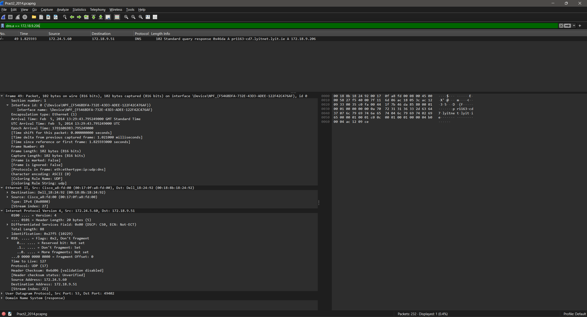

# DNS Query Analysis — Domain Name System Traffic Study

## Overview

This repository documents a packet-level analysis of DNS (Domain Name System) traffic captured using Wireshark, covering hostname resolution, subnet derivation, and DNS caching behaviour across two separate capture sessions.

The analysis covers:

- DNS response packet identification
- Hostname resolution from a DNS response
- Subnet derivation from a resolved IP address
- DNS TTL caching behaviour and its effect on subsequent captures

---

## Logical Flow

```
Query-Response Identification → Hostname Resolution → IP-to-Subnet Mapping → DNS Caching Behaviour
```

Each stage builds on the previous: first confirming what the DNS packet is and what it resolved, then deriving the network context of the resolved IP, and finally explaining why DNS traffic disappears entirely in the second capture session due to caching.

---

## 1. Identifying a DNS Response Packet (Capture A — Packet 49)

Packet 49 was identified as a DNS protocol response — a UDP-based reply (Protocol 17, Port 53) from DNS server **172.24.5.60** to client **172.18.9.51**. It answered the query from packet 48, resolving the Fully Qualified Domain Name (FQDN) `pr1163-cd7.lyitnet.lyit.ie` to IP address **172.18.9.206**.

**Key packet details:**

| Field | Value |
|---|---|
| Packet | 49 |
| Protocol | DNS (UDP) |
| Transport Port | 53 |
| DNS Server (Source) | 172.24.5.60 |
| Client (Destination) | 172.18.9.51 |
| Query Packet | 48 |
| Resolved FQDN | pr1163-cd7.lyitnet.lyit.ie |
| Resolved IP | 172.18.9.206 |
| TTL | 127 (one router hop) |

The TTL of 127 indicates only one router hop in the path. The absence of a TCP three-way handshake confirms UDP as the transport layer protocol — consistent with DNS lookups, video streaming, and online gaming, all of which prioritise low-latency delivery over reliability.

The query targets a hostname within the `lyitnet.lyit.ie` domain, confirming this was an **internal institutional DNS query** rather than a public internet lookup. Traffic can be isolated for analysis using the Wireshark display filter `dns`.

---

📷 **Image 1 — DNS Response Packet 49 (Capture A)**


---

## 2. Hostname Resolution from DNS Response

Applying the Wireshark filter `dns.a == 172.18.9.206` returned the DNS response in packet 49, from which the hostname mapped to IP address 172.18.9.206 was extracted.

**Resolved hostname:** `pr1163-cd7.lyitnet.lyit.ie`

**FQDN structure breakdown:**

| Component | Value | Meaning |
|---|---|---|
| Hostname | `pr1163-cd7` | Device-level identifier |
| Subdomain | `lyitnet` | Internal LYIT network segment |
| Domain | `lyit.ie` | Institutional top-level domain |

This FQDN identifies the device as an internal institutional resource within the LYIT (now ATU) network. The internal domain structure confirms the DNS query never left the local network boundary, and the response was served by an internal DNS resolver.

---

📷 **Image 2 — DNS Filter dns.a == 172.18.9.206 and Resolved Hostname**



---

## 3. Deriving the Device Subnet from its Resolved IP

With the resolved IP **172.18.9.206** and subnet mask **255.255.248.0 (/21)**, the network subnet was calculated as follows.

**Subnet calculation:**

```
IP Address:    172.18.9.206
Subnet Mask:   255.255.248.0  (/21)

/21 = 21 network bits
Third octet network bits = 21 - 24 = 3 host bits remaining
Block size = 2^3 = 8 (in the 3rd octect)

Network Address:   172.18.8.0
Broadcast Address: 172.18.15.255
Usable Hosts:      (2^11) - 2 = 2,046
Usable Range:      172.18.8.1 – 172.18.15.254
```

**Subnet summary table:**

| IP | Mask | Network | Range | Broadcast | Usable Hosts |
|---|---|---|---|---|---|
| 172.18.9.206 | 255.255.248.0 | 172.18.8.0 | 172.18.8.1 – 172.18.15.254 | 172.18.15.255 | 2,046 |

The presence of a /21 subnet suggests **VLAN segmentation** is configured on this network. This is a standard enterprise security practice used to isolate traffic domains, reduce broadcast collisions, and enforce ACL (Access Control List) policies — all essential for proper routing performance and security boundary enforcement.

---

## 4. DNS Caching Behaviour — Why No DNS Traffic in Capture B

In the second packet capture (Capture B), packets 212 and 213 showed ICMP communication between the same two hosts — yet **no DNS query or response was observed**.

**Root cause: DNS TTL-based caching.**

The hostname-to-IP mapping for `pr1163-cd7.lyitnet.lyit.ie → 172.18.9.206` had already been resolved in Capture A (packet 49). That DNS answer was cached in the local DNS resolver with a TTL of **3,600 seconds (1 hour)**. When the `ping` command was subsequently executed in Capture B, the operating system retrieved the IP address directly from its local cache rather than issuing a new DNS query — eliminating any DNS network traffic entirely.

**DNS caching flow:**

```
Capture A (Packet 49):
  DNS Query  → 172.24.5.60 asks: what is pr1163-cd7.lyitnet.lyit.ie?
  DNS Response ← 172.18.9.206  (TTL = 3600s, cached locally)

Capture B (Packets 212-213):
  OS checks local DNS cache → IP already known (cache still valid)
  No DNS query issued → ARP is the first visible protocol instead
  ICMP proceeds directly using cached IP
```

This explains why **ARP — not DNS — was the first visible protocol in Capture B**. ARP was still required to resolve the MAC address of 172.18.9.206 at Layer 2, even though the IP address was already known from the DNS cache at Layer 3.

This is normal, expected DNS TTL caching behaviour and demonstrates the efficiency benefit of local DNS caching in reducing repetitive query traffic across the network.

---

📷 **Image 4 — Capture B Showing No DNS Traffic (ARP First)**


---

## Conclusion

The DNS analysis confirms successful internal hostname resolution via UDP on port 53, correctly mapping `pr1163-cd7.lyitnet.lyit.ie` to 172.18.9.206 within the LYIT institutional network. The /21 subnet derivation places the device within the 172.18.8.0 network, supporting 2,046 usable hosts across a VLAN-segmented enterprise infrastructure.

The absence of DNS traffic in Capture B is fully explained by TTL-based caching behaviour — a fundamental DNS efficiency mechanism that reduces unnecessary query overhead and confirms the DNS resolver was operating correctly across both capture sessions.

---

*Analysis performed using Wireshark. Capture files and supporting images are included in this repository.*
