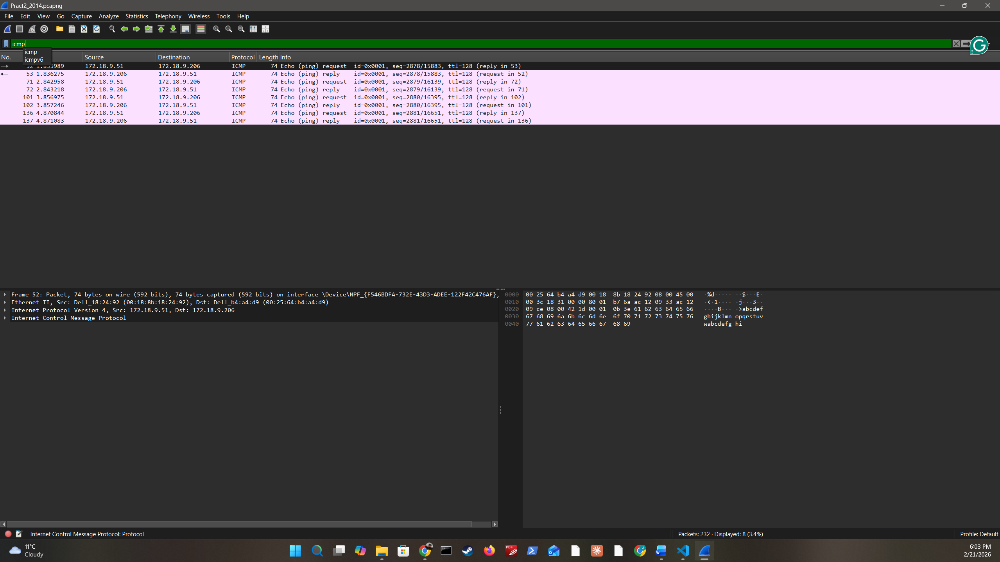
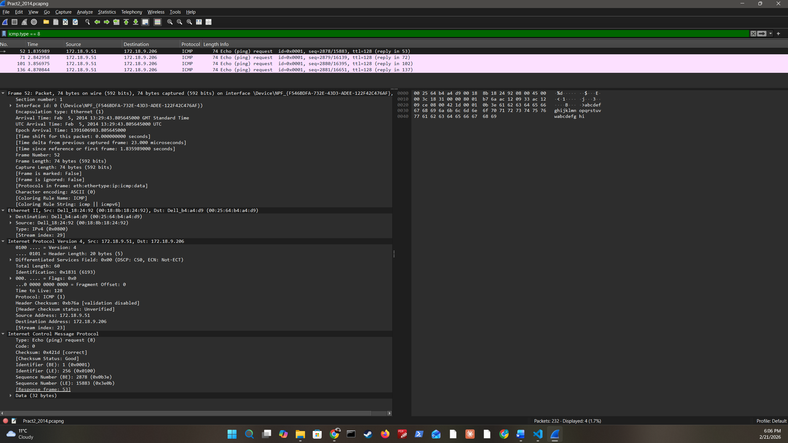
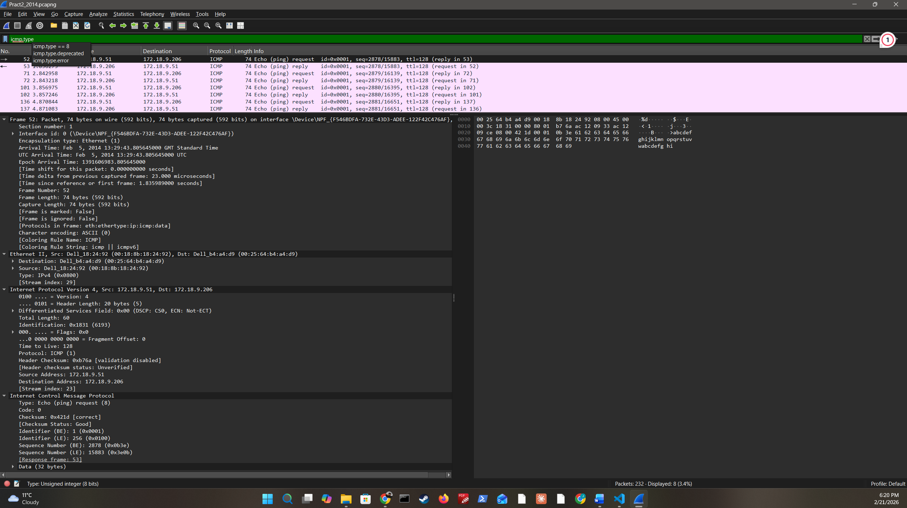
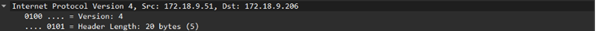
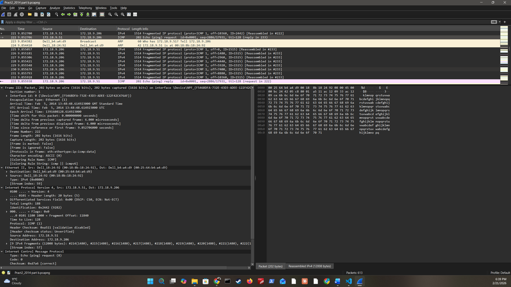
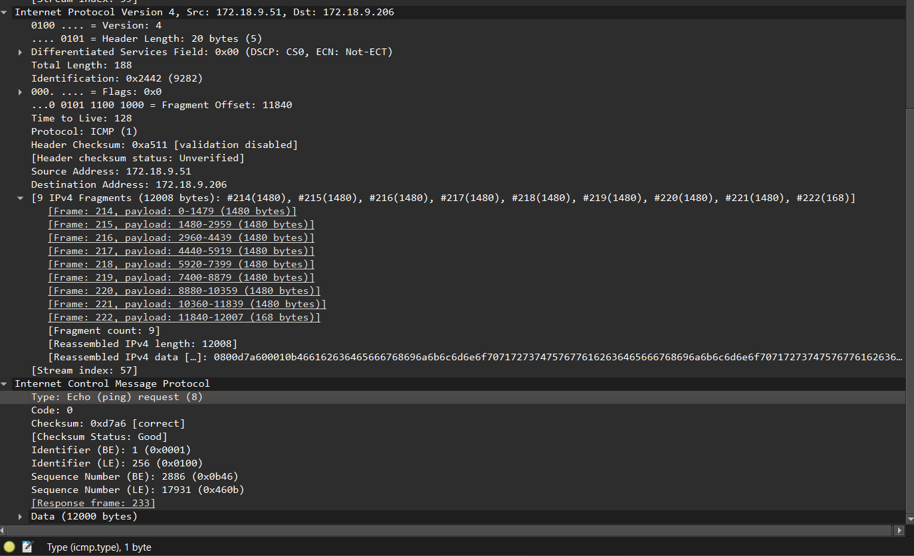
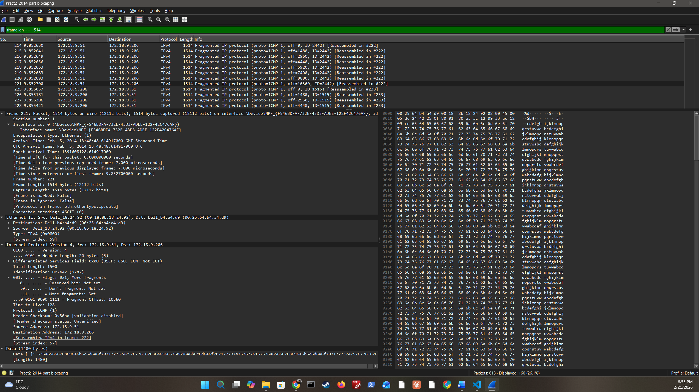

# ICMP Traffic Analysis and Fragmentation Study

## Overview

This repository documents a detailed packet-level analysis of ICMP (Internet Control Message Protocol) traffic captured using Wireshark.

The analysis covers:

- ICMP protocol identification
- Traffic isolation using filters
- OSI layer filtering boundaries
- Traffic volume assessment
- ARP-triggered ICMP exchange
- IPv4 fragmentation mechanics
- MTU boundary analysis
- Security implications and mitigations

---
## Logical Flow

```
Protocol Identification → Traffic Isolation → Layer Constraints → Traffic Volume
→ ARP-Triggered ICMP Exchange → Fragmentation Mechanics → MTU Threshold Analysis → Security Implications
```

Each stage builds deliberately on the previous: first confirming what the ICMP packets are and where they came from, then narrowing focus using filters, establishing what layer boundaries apply, and quantifying the traffic pattern. The second capture session then introduces fragmentation — analysing how an oversized payload is broken down, tracked via IP Identification, and reassembled — before concluding with the security implications of ICMP misuse and the defensive controls required to mitigate them.

---

## 1. ICMP Protocol Identification and Functional Overview (CAPTURE A)

Packets 52 and 53 were identified as ICMP Echo Request (Type 8) and Echo Reply (Type 0) respectively. ICMP operates at Layer 3 (Network Layer) over IPv4 and is primarily used for host reachability testing and diagnostics.

**Capture summary:**

| Field | Value |
|---|---|
| Source | 172.18.9.51 |
| Destination | 172.18.9.206 |
| RTT | 0.286 ms |
| TTL | 128 |
| Request-Reply Pairs | 4 (successful) |
| Packet Loss | None |

**Common ICMP message types:**

| Type | Message | Description |
|---|---|---|
| 8 | Echo Request | Initial ping sent to test connectivity |
| 0 | Echo Reply | Direct response to the Echo Request |
| 3 | Destination Unreachable | Sent when a packet cannot reach its destination |
| 11 | Time Exceeded | Sent when a packet's TTL expires in transit |
| 5 | Redirect Message | Used by routers to notify hosts of a better path |

---

📷 **Image 1 — ICMP Echo Request and Reply Pair**



From the capture: Source host 172.18.9.51 successfully pinged the destination 172.18.9.206 with a round-trip time of 0.286ms and a TTL of 128, confirming both hosts were active on the same subnet with no routing failures, packet loss, or firewall interference. The sequence numbers are uniquely tied to each request and reply echo for the 4 successful pairs. Packets 52–53 (seq=2878/15883) confirm they are part of the same ping exchange. ICMP tools such as ping, traceroute, and network metrics utilities make it a fundamental diagnostic protocol.

---

## 2. Targeted Traffic Isolation Using Wireshark Filters (CAPTURE A)

To isolate ICMP traffic within a mixed-protocol capture, the display filter `icmp` was applied. Additional granular filters were documented to allow analysts to rapidly narrow focus to specific traffic types during live triage or post-capture forensic review.

| Filter | Purpose |
|---|---|
| `icmp` | All ICMP packets |
| `icmp.type == 8` | Echo Requests only |
| `icmp.type == 0` | Echo Replies only |
| `ip.proto == 1` | ICMP via IPv4 protocol number |

---

📷 **Image 2 — ICMP Display Filter Applied**



---

## 3. OSI Layer Boundaries and Filtering Constraints (CAPTURE A)

ICMP operates exclusively at Layer 3 (Network layer) and does not use port numbers, making Layer 4 (Transport) filters such as `tcp` or `udp` inapplicable. Attempting to apply transport-layer filters to ICMP yields no results, as ICMP has no concept of sessions or segments.

| OSI Layer | Name | Wireshark Filter | Key Features |
|---|---|---|---|
| Layer 4 | Transport | `tcp` / `udp` | Ports, sessions, segments |
| Layer 3 | Network | `icmp` | IP addresses, ICMP type/code |

> **Note:** While TCP visibility can extend to Layer 3 details such as IP headers, filters are layer-specific and cannot be directly cross-applied between layers.

---

## 4. ICMP Traffic Pattern and Volume Analysis (CAPTURE A)

Applying the `icmp` display filter returned **8 ICMP packets** in total:

- 4 Echo Requests (Type 8)
- 4 Echo Replies (Type 0)

All requests received immediate replies, indicating stable network behaviour with no abnormalities. An abnormal pattern — such as requests without replies, or repetitive high-volume pings — would likely indicate a Ping Flood or Ping of Death attack.

---

📷 **Image 4 — Traffic Volume Pattern**



---

## 5. ARP Resolution and ICMP Session Initiation (Capture B — Packet 222)

Before ICMP communication occurred, ARP resolved the MAC address mapping between 172.18.9.51 and 172.18.9.206. This address resolution is a prerequisite for any Layer 2 frame delivery, including ICMP traffic, on a local subnet.

📷 **Image 5a — ARP Table Before ICMP Exchange**



Following ARP resolution, ICMP Echo traffic was initiated across packets 214–222. Packet 222 was identified as the final reassembly point of 9 fragmented IPv4 packets, carrying a total payload of 12,008 bytes — well above the standard Ethernet MTU of 1,500 bytes. The complete ICMP Echo Request payload was only visible once all fragments were fully reassembled at the destination.

---

📷 **Image 5 — ARP Resolution Before ICMP Exchange**



---

## 6. IPv4 Fragmentation and Reassembly (Capture B 214–222)

An oversized ICMP Echo Request of **12,008 bytes** required fragmentation into 9 packets (frames 214–222) to traverse the standard Ethernet MTU of 1,500 bytes.

**Fragmentation calculation:**

```
Total payload = ICMP header (8 bytes) + data (12,000 bytes) = 12,008 bytes
Max data per fragment = MTU (1,500) − IP header (20) = 1,480 bytes
Number of fragments = 12,008 ÷ 1,480 = 8.114 → 9 fragments

Fragments 1–8: 1,480 bytes each
Fragment 9:    168 bytes (remainder)
```

All 9 fragments shared the same IP Identification value (**ID = 0x2442**), enabling the destination host to reassemble them in the correct sequence. This behaviour confirmed no fragment loss and no reassembly errors during transmission.

> **Note on IP Identification:** ID=0x2442 is specific to the fragmented session observed in frames 214–222. A separate fragmented ICMP session — reassembled at packet 268 — carries a distinct identifier of **ID=0x1516**. Each original datagram receives its own unique 16-bit identifier that all of its fragments inherit independently.

---

📷 **Image 6 — Fragmented ICMP Packets**



**Security note:** IP/ICMP fragmentation can be exploited in DDoS flooding attacks, where an attacker overwhelms a destination with fragmented packets from multiple sources, exhausting the memory allocated for fragment reassembly. Recommended mitigation is to deploy modern stateful firewalls that reassemble fragments before inspection.

---

## 7. MTU Threshold and Frame Size Boundary Analysis

**Filter applied:**

```
frame.len == 1514
```

Applying `frame.len == 1514` returned **161 packets**. This filter confirms the maximum Ethernet frame size: 1,500 bytes payload + 14-byte Ethernet header = **1,514 bytes total**. It isolates the maximum-size IPv4 fragment packets belonging to fragmented ICMP Echo requests.

Of those 161 packets, **19 fragmented ICMP Echo requests** were identified, each with a payload frame length of 12,800 bytes. Each fragmented Echo request produces the same 9 MTU-sized fragments:

- Fragments 1–8: 1,480 bytes each
- Fragment 9: 168 bytes (remainder)

**Fragment count verification:**

```
Total data = ICMP header (8 bytes) + payload (12,000 bytes) = 12,008 bytes
Max data per fragment = MTU (1,500) − IP header (20) = 1,480 bytes
Number of fragments = 12,008 ÷ 1,480 = 8.114 → 9 fragments
```

The IP Identification field serves as the primary link between all fragments and their parent datagram. In this MTU boundary session, all fragments reassembled at **packet 268** share the identifier **ID=1516 (0x1516)** — distinct from the 0x2442 session documented in Section 6.

---

📷 **Image 7 — MTU Boundary Frame Filter**



From the capture, source 172.18.9.51 and destination 172.18.9.206 are consistent throughout, with no lost fragments or anomalies detected.

---

## 8. Security Implications and Defensive Controls

While ICMP is essential for network diagnostics, it presents notable attack surfaces that analysts must actively monitor.

### Threat Landscape

| Threat | Description |
|---|---|
| **Ping sweeps (reconnaissance)** | Attackers use ICMP Echo (Type 8) to map live hosts, discover firewall rules, and exploit network topology |
| **ICMP tunneling** | Echo Request/Reply data fields can carry hidden payloads, bypassing basic firewalls for covert data exfiltration |
| **Ping Flood / Smurf attacks** | High-volume or amplified ICMP traffic overwhelms targets, causing denial of service |
| **Fragmentation-based DoS** | Oversized or malformed fragments exhaust reassembly memory at the destination |
| **Firewall evasion via spoofing** | ICMP blended with other protocols during low-traffic windows to evade detection |

### Recommended Mitigations

- **Restrict ICMP types** — Allow only necessary ICMP types (e.g., Echo Request/Reply for diagnostics in secured segments); drop or rate-limit all others.
- **Inspect ICMP payloads** — Use deep packet inspection or dedicated tunneling detection techniques to identify data hidden within Echo messages.
- **Rate-limit Echo requests** — Prevent high-volume ping traffic from overwhelming hosts or network infrastructure.
- **Fragment reassembly before inspection** — Configure stateful firewalls to fully reassemble fragmented packets before applying security rules.
- **Network segmentation** — Enforce strict subnet controls and microsegmentation to contain the blast radius of any ICMP-based attack.
- **Comprehensive logging** — Enable and monitor ICMP event logs to support incident response and forensic analysis.

---

## Conclusion

The capture reflects normal ICMP diagnostic activity with successful ARP resolution, proper fragmentation handling across two distinct sessions (ID=0x2442 and ID=0x1516), and no packet anomalies detected.

However, ICMP misuse can introduce significant security risks — including reconnaissance, covert tunneling, and denial-of-service attacks — if not properly monitored, filtered, and controlled within a layered defensive architecture.

---

*Analysis performed using Wireshark. Capture files and supporting images are included in this repository.*
