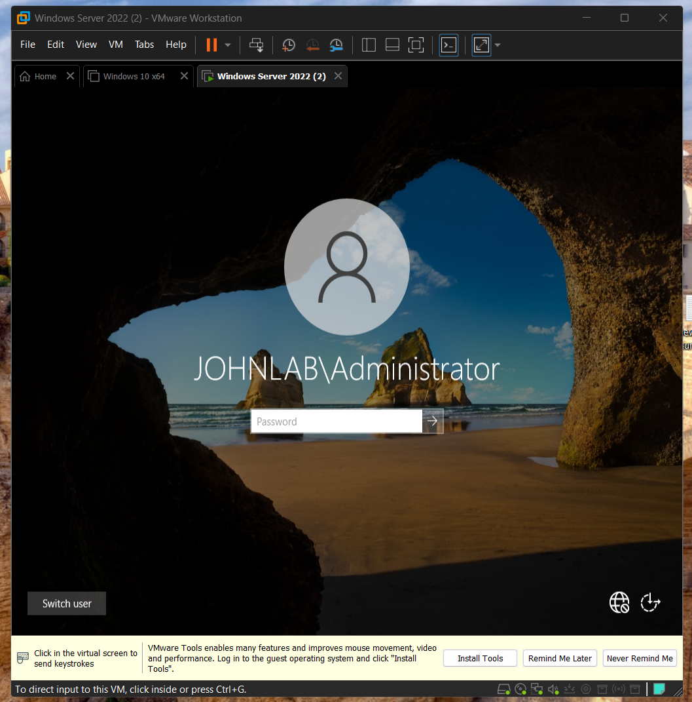
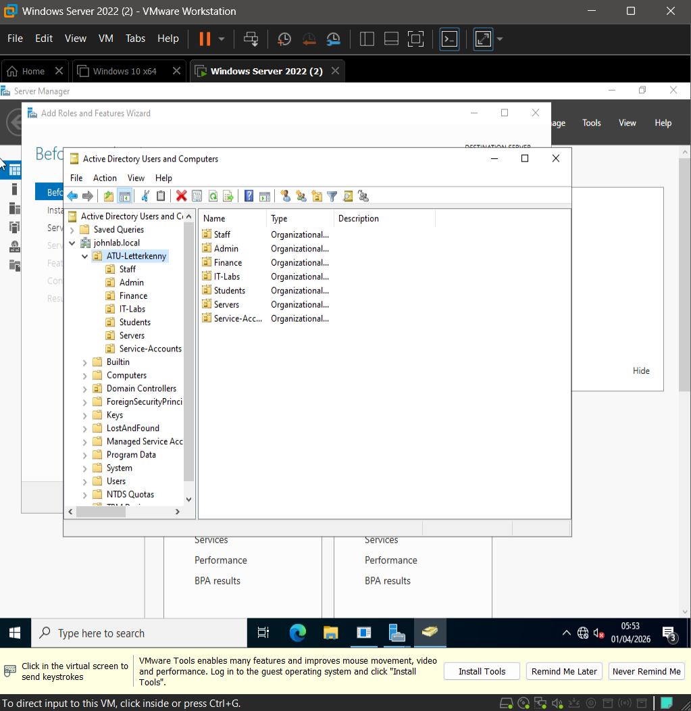
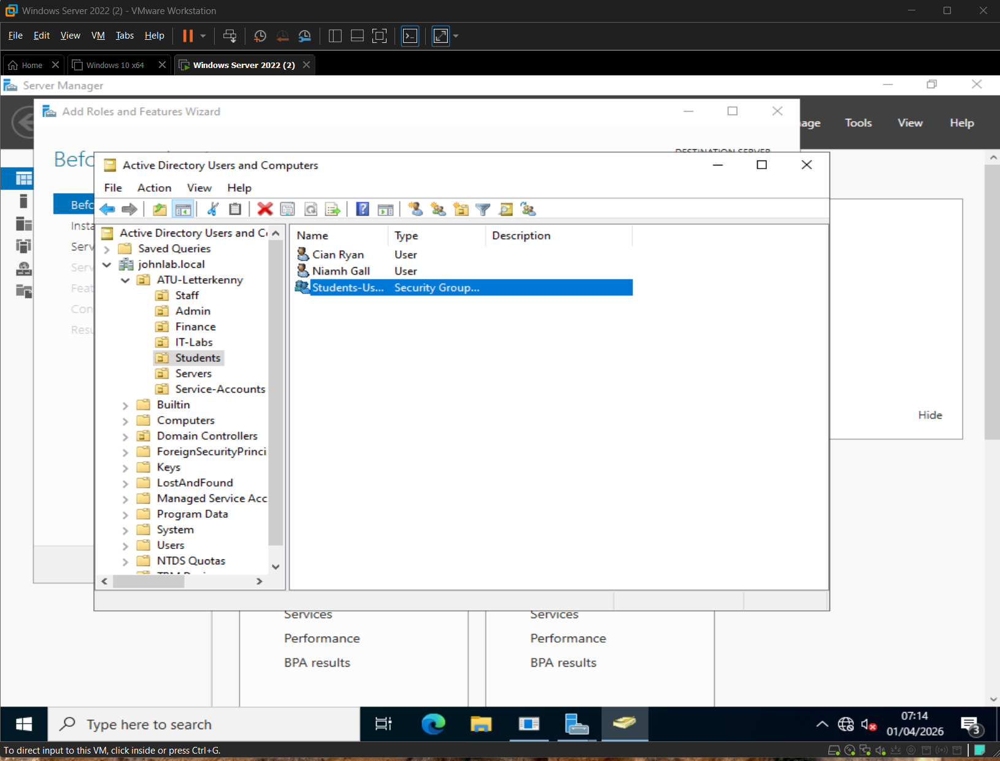
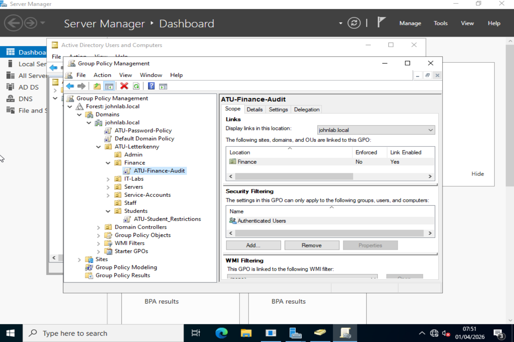
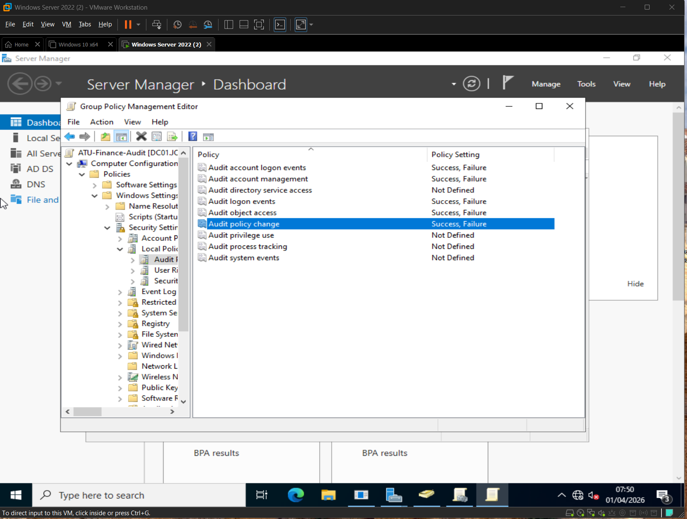
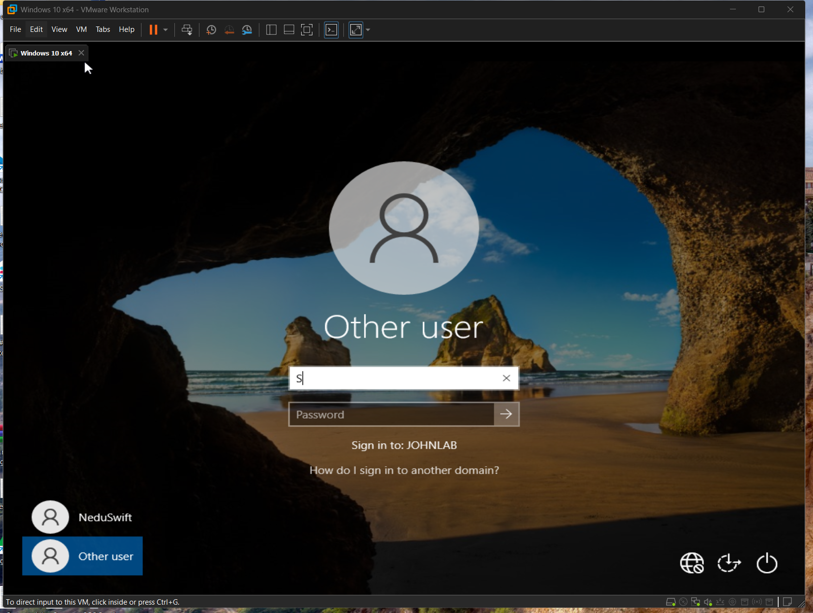
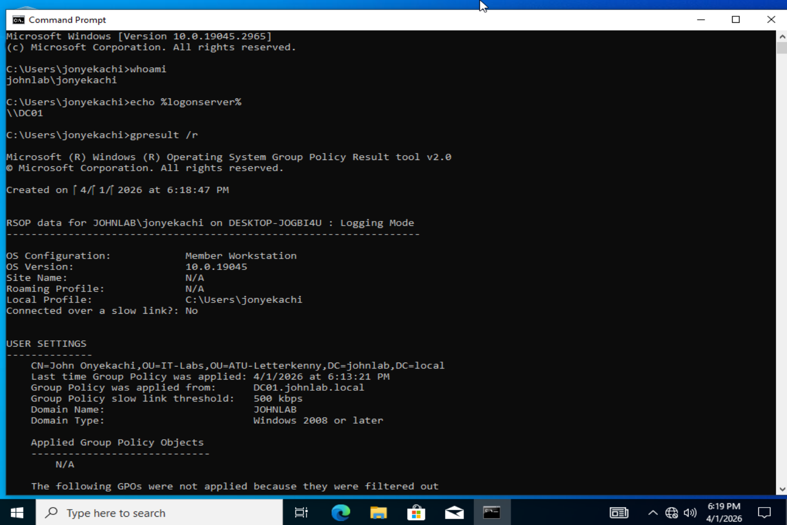

# Active Directory Enterprise Lab

**Identity & Infrastructure Project | MSc Cybersecurity Portfolio**
*Atlantic Technological University, Letterkenny | April 2026*

> This lab builds a three-phase enterprise Active Directory environment progressing from a local on-premises domain through Azure hybrid identity to Microsoft Sentinel SIEM monitoring. Each phase represents a distinct layer of real-world enterprise identity architecture that maps to [Enterprise Campus Network Design](../Campus-Network-Design/).

---

## Lab Architecture

```
PHASE 1 — Local AD (Complete)
┌─────────────────────────────────────────────┐
│           VMware Workstation Player          │
│                                             │
│  DC01 (Windows Server 2022)                 │
│  ├── Domain: johnlab.local                  │
│  ├── ADDS + DNS + Global Catalog            │
│  ├── 7 OUs, 9 Users, 4 Security Groups      │
│  └── 3 GPOs (Password, Restrictions, Audit) │
│                          │                  │
│  CLIENT01 (Windows 10)   │                  │
│  ├── Domain joined        │                  │
│  ├── Auth via Kerberos ───┘                  │
│  └── GPO applied and verified               │
│                                             │
│  Network: 192.168.10.0/24 (Host-Only)       │
└─────────────────────────────────────────────┘

PHASE 2 — Azure Hybrid (Planned)
┌─────────────────────────────────────────────┐
│  Azure Entra ID (formerly Azure AD)         │
│  ├── Azure AD Connect sync from DC01        │
│  ├── Hybrid identity — same users in cloud  │
│  └── MFA enforcement via Conditional Access │
└─────────────────────────────────────────────┘

PHASE 3 — Sentinel SIEM (Planned)
┌─────────────────────────────────────────────┐
│  Microsoft Sentinel                         │
│  ├── Windows Security Event log ingestion   │
│  ├── Detection rules for Event IDs:         │
│  │   4625 (failed logon), 4740 (lockout)    │
│  │   4720 (account created), 4719 (tamper)  │
│  └── Incident response playbooks            │
└─────────────────────────────────────────────┘
```

---

## Network Context

This lab runs on an isolated Host-Only VMware network (192.168.10.0/24). In a production deployment, DC01 would reside in the **Servers VLAN (VLAN 12, 172.16.10.192/27)** of an enterprise campus network, accessible only from Admin VLAN (VLAN 6) and Management VLAN (VLAN 99) via inter-VLAN routing and ACL enforcement at the MDF core switch.

See: [Enterprise Campus Network Design](../Campus-Network-Design/) for the network architecture this lab integrates with.

---

## Phase 1 — Local Active Directory Domain


> **Figure 0:** DC01 login screen displaying JOHNLAB\Administrator: confirmation that the domain was successfully created and the server promoted to Domain Controller.

### VM Specifications

| VM | Role | OS | RAM | Disk | CPUs | IP |
|---|---|---|---|---|---|---|
| DC01 | Domain Controller | Windows Server 2022 | 4 GB | 40 GB | 2 | 192.168.10.1 |
| CLIENT01 | Domain Workstation | Windows 10 x64 | 4 GB | 30 GB | 2 | 192.168.10.10 |

### Domain Configuration

| Setting | Value |
|---|---|
| Domain Name | johnlab.local |
| NetBIOS Name | JOHNLAB |
| Forest Functional Level | Windows Server 2016 |
| DNS Server | DC01 (192.168.10.1) |
| DSRM | Configured (secured) |

### 1.2. OU Architecture

Designed to mirror the VLAN segmentation from the Enterprise Campus Network Design:

```
johnlab.local
└── ATU-Letterkenny
    ├── Staff              (maps to VLAN 4 — Staff)
    ├── Admin              (maps to VLAN 6 — Admin)
    ├── Finance            (maps to VLAN 7 — Finance)
    ├── IT-Labs            (maps to VLAN 2 — Labs)
    ├── Students           (maps to VLAN 3 — Students)
    ├── Servers            (maps to VLAN 12 — Servers)
    └── Service-Accounts   (cross-cutting — no direct VLAN)
```


> **Figure 1:** OU hierarchy under ATU-Letterkenny mirroring VLAN segmentation from the Enterprise Campus Network Design project.

### 1.3. Domain Users

| User | Username | OU | Security Group |
|---|---|---|---|
| Mary Murphy | mmurphy | Staff | Staff-Users |
| Patrick Kelly | pkelly | Staff | Staff-Users |
| Claire Byrne | cbyrne | Finance | Finance-Users |
| Seamus Walsh | swalsh | Finance | Finance-Users |
| Aoife O'Brien | aobrien | Admin | — |
| John Onyekachi | jonyekachi | IT-Labs | IT-Admins |
| Cian Ryan | cryan | Students | Students-Users |
| Niamh Gallagher | ngallagher | Students | Students-Users |
| svc_backup | svc_backup | Service-Accounts | — |


> **Figure 2:** Domain users for Students OUs. Each user's LDAP Distinguished Name reflects their OU placement, which determines GPO application.

### 1.4. Security Groups (AGDLP Pattern)

| Group | Type | Scope | Members |
|---|---|---|---|
| Finance-Users | Security | Global | cbyrne, swalsh |
| IT-Admins | Security | Global | jonyekachi |
| Staff-Users | Security | Global | mmurphy, pkelly |
| Students-Users | Security | Global | cryan, ngallagher |

### 1.5. Group Policy Objects

| GPO | Linked To | Key Settings |
|---|---|---|
| ATU-Password-Policy | johnlab.local | 12-char min, complexity, 90-day max, 10 history, 5-attempt lockout |
| ATU-Student-Restrictions | Students OU | Control Panel blocked, removable storage denied, software install blocked |
| ATU-Finance-Audit | Finance OU | 5 audit categories — generates Event IDs 4624, 4625, 4720, 4740, 4719 |


> **Figure 3:** Group Policy Management Console showing ATU-Password-Policy linked at Domain level, ATU-Finance-Audit linked to Finance OU, & ATU-Student-Restrictions linked to Students OU.


> **Figure 4:** ATU-Password-Policy configured with 12-character minimum length, complexity enabled, 90-day maximum age, and 10-password history, aligned to NIST SP 800-63B.


> **Figure 5:** ATU-Finance-Audit policy showing five audit categories set to Success and Failure; generating Event IDs consumed by SIEM in Phase 3.

### Verification Evidence

```
C:\Users\jonyekachi> whoami
johnlab\jonyekachi

C:\Users\jonyekachi> echo %logonserver%
\\DC01

C:\Users\jonyekachi> gpresult /r
RSOP data for JOHNLAB\jonyekachi
Group Policy applied from: DC01.johnlab.local
CN=John Onyekachi,OU=IT-Labs,OU=ATU-Letterkenny,DC=johnlab,DC=local
```


> **Figure 6:** CLIENT01 login screen confirming successful domain join — "Sign in to: JOHNLAB" indicates Kerberos authentication is now handled by DC01.


> **Figure 7:** Command-line verification confirming domain membership (johnlab\jonyekachi), authentication source (\\DC01), and LDAP Distinguished Name (CN=John Onyekachi,OU=IT-Labs,OU=ATU-Letterkenny,DC=johnlab,DC=local).

---

## SOC Relevance — Event IDs Generated

The Finance Audit GPO generates the following Windows Security Event IDs, which feed directly into the Microsoft Sentinel workspace in Phase 3:

| Event ID | Description | Detection Use Case |
|---|---|---|
| 4624 | Successful logon | Baseline normal behaviour |
| 4625 | Failed logon | Brute force detection |
| 4720 | User account created | Rogue account creation alert |
| 4740 | Account locked out | Lockout storm detection |
| 4719 | Audit policy changed | GPO tamper detection |
| 4768 | Kerberos TGT requested | Kerberoasting baseline |
| 4769 | Kerberos service ticket | Pass-the-Ticket detection |

---

## MITRE ATT&CK Context

This lab environment is deliberately designed to understand the attacker's perspective on Active Directory:

| Technique | ID | What it targets in this lab |
|---|---|---|
| Kerberoasting | T1558.003 | Service accounts (svc_backup) |
| DCSync | T1003.006 | DC01 — replication privilege abuse |
| Pass the Hash | T1550.002 | NTLM hashes from domain users |
| Golden Ticket | T1558.001 | krbtgt account on DC01 |
| Account Discovery | T1087.002 | OU and user enumeration |

Understanding these attack paths against the environment you built is the foundation of effective SOC detection — you know what normal looks like, so anomalies are visible.

---

## Repository Structure

```
Active-Directory-Enterprise-Lab/
├── README.md                          ← This file
├── PROJECT_SUMMARY.md                 ← Portfolio summary (2-3 min read)
├── Phase-1-Local-AD/
│   ├── screenshots/                   ← Build evidence screenshots
│   ├── gpo-exports/                   ← Exported GPO backup files
│   └── verification/                  ← gpresult, whoami, ping outputs
├── Phase-2-Azure-Hybrid/              ← Planned
│   └── README.md
└── Phase-3-Sentinel-SIEM/             ← Planned
    └── README.md
```

---

## Implementation Status

| Phase | Description | Status |
|---|---|---|
| 1a | VM provisioning, DC01 promotion, domain creation | Complete |
| 1b | OU structure, user accounts, security groups | Complete |
| 1c | GPO deployment and verification | Complete |
| 1d | CLIENT01 domain join and GPO confirmation | Complete |
| 2 | Azure Entra ID hybrid sync via AD Connect | Planned |
| 3 | Microsoft Sentinel SIEM integration | Planned — dissertation phase |

---

## Related Projects

- [Enterprise Campus Network Design](../Campus-Network-Design/) — network architecture this lab integrates with
- [Splunk SIEM Lab](../Splunk-SIEM/) — parallel SIEM platform experience
- [MSc Dissertation — n8n as SOAR](../Dissertation/) — automation layer to be built on this infrastructure

---

**References:**
Microsoft (2024). Active Directory Domain Services Overview. Microsoft Learn. Available at: https://learn.microsoft.com/en-us/windows-server/identity/ad-ds/get-started/virtual-dc/active-directory-domain-services-overview

NIST (2020). Special Publication 800-63B: Digital Identity Guidelines. National Institute of Standards and Technology. Available at: https://pages.nist.gov/800-63-3/sp800-63b.html

MITRE (2024). ATT&CK Framework v14. MITRE Corporation. Available at: https://attack.mitre.org

Stanek, W.R. (2013). *Windows Server 2012 R2 Inside Out*. Microsoft Press.

[← Back to Portfolio](../README.md) | [View Project Summary](./PROJECT_SUMMARY.md)
